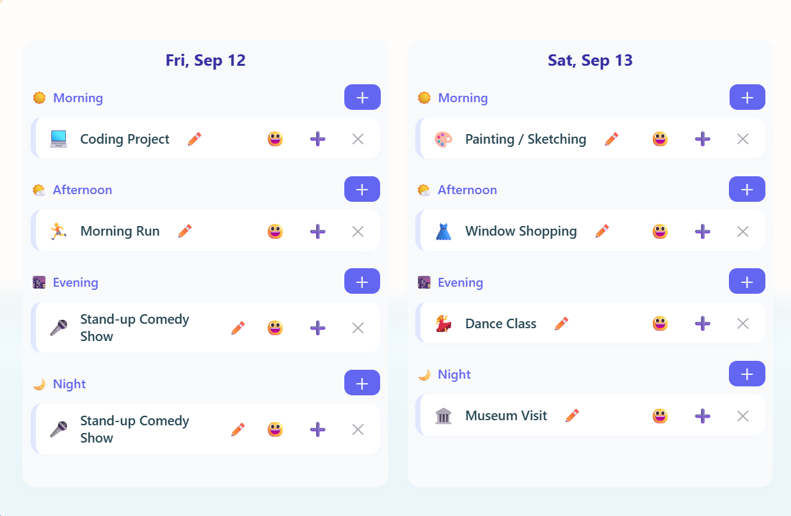
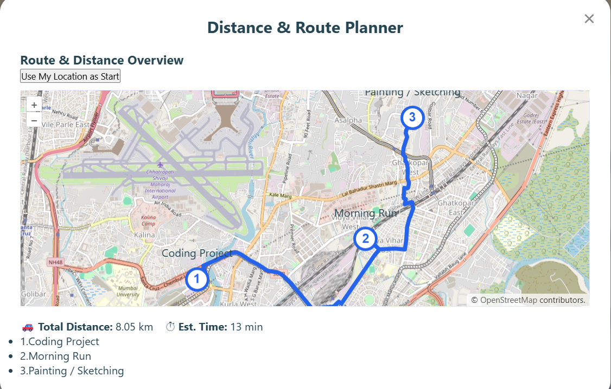

👇

🎉 Weekendly – Your Personal Weekend Planner

Atlan Frontend Engineering Internship Challenge – 2025

🌟 Weekendly is a playful yet powerful web app to design, visualize, and share memorable weekends.
From brunches to hikes, from lazy Sundays to adventurous getaways — Weekendly helps you plan it all with ease, fun, and creativity.

✨ Features at a Glance

✅ Core Planning

🗓 Plan for weekends or long weekends (holiday-aware).

⏰ Organize activities by Morning / Afternoon / Evening / Night.

🧩 Drag & drop interface to rearrange plans easily.

📝 Add custom activities alongside the built-in suggestions.

🎭 Personalization

💫 Assign moods/vibes (relaxed, energetic, party, adventurous).

🎨 Choose from themes like Lazy Weekend, Adventurous Escape, Family Time.

🎭 Activities represented as cards with icons/emoji + mood tags for a delightful UX.

🌍 Smart Integrations

🌦 Weather awareness – recommends indoor/outdoor activities based on real-time weather (OpenWeatherMap API).

📍 Location mapping – add places to activities and view them on an interactive map.

🗺 Route + distance calculation – see travel path, total distance & estimated time.

🍔 (Optional) Integration ideas – find nearby food spots/events for even richer planning.

🤖 Assistance

💬 Chatbot recommender suggests activities based on your mood, category, or weather.

🎯 Recommendations mapped intelligently (e.g., “adventure” → hiking, outdoor sports).

🖼 Share & Save

💾 Persistent storage in localStorage (no backend needed).

📤 Export your weekend plan as a poster/image card (via html2canvas).

✏️ Rename, edit, and save multiple plans for reuse.

⚡ Engineering Extras

📱 PWA Support – install Weekendly like a native app, works offline.

🧪 Testing – component-level tests with React Testing Library ensure reliability.

📐 Reusable UI components – clean, modular architecture (mini design system).

🚀 Scales to 50+ activities with smooth performance.

♿ Accessibility – semantic HTML, aria-labels, and keyboard-friendly navigation.

🛠 Tech Stack

Framework: React + Vite

State Management: React Hooks + Context API

Routing: react-router-dom

UI/UX: Custom components, CSS, responsive design, emojis/icons

APIs:

OpenWeatherMap – weather + forecast

Map integration – route & distance

Libraries:

react-calendar – calendar & long weekends

html2canvas – export as image

Testing: React Testing Library + Jest

Deployment: Vercel / Netlify

Offline: PWA + localStorage

🚀 Getting Started

Clone the repo

git clone https://github.com/your-username/weekendly.git
cd weekendly

Install dependencies

npm install

Run locally

npm run dev

Build for production

npm run build

🧪 Testing

Run component tests:

npm test

📦 Deployment

👉 Live Demo: [live](https://5e824225.weekendly.pages.dev/)

## 📸 Screenshots  

### 🏠 Landing Page  
  

### 📅 Weekend Planner  
  

### 🗺 Map & Distance Calculation  
  

